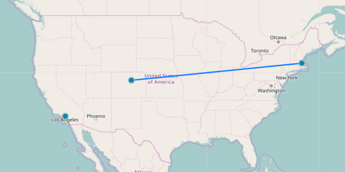
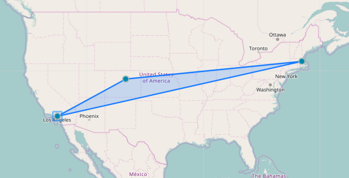
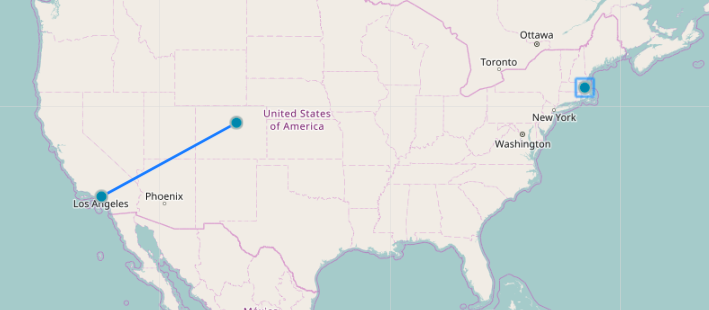

# Concept3D Interview : The Technical Challenge

### Overview

Hello prospective candidate! In this repo, you're given a boilerplate that contains most of the libraries you'll need to complete the challenge. It's intended to examine your abilities in the following areas:

1. React/Redux knowledge
3. Algorithmic problem solving
4. General self-ownership of code in order to solve a problem
5. Comfort diving into the docs in order to learn new technologies
5. Ability to write clean, well organized, and refactored code
6. Git usage and best practices

### Requirements

1. This boilerplate effectively contains two applications: A React Redux application that has been bootstrapped with Create React App, and an Express API. You'll notice that, at the moment, the API uses app.locals as a data store. Please Familiarize yourself with this, so that you can understand how to add locations to it, but you will not need to change this to a database unless you wish to do extra credit.  The first requirement is to make sure the three locations on the server appear when you open the web application:

    ```When I navigate to the root path of the application, I see the three seeded markers displayed on the page.```


2. As you'll see when you look into the Front-End boilerplate, there are two major components. The Form and the Map. The form will be used to add new markers to the map. The basic form has been set up, but lacks the functionality to save new markers. This part has two aspects - client side and server side. The user story is:

    ```When I enter a valid latitude and longitude into the form with a name, and then press enter, I will see a new marker added to the map with the correct name in the popup. If there are errors, I will see them rendered on screen. On success, the map will pan to the new marker's coordinates.```

    Notes:

    - **Valid** latitude and longitude is important. As is the existence of a name.
    - Verify lat, lng, and name.
    - Return meaningful error messages to the Front-End and render them accordingly.
    - Use Redux and Reducers to update the state of your app (you can use local state).
    - When adding a new marker, the center of the map will be set to the `[lat, lng]` of the new marker.


3. Now that you're adding your new markers and saving them, let's make some shapes! Using the Leaflet library, let's make a polygon out of our markers. Here's the user story:

      ```When I click on a marker, it's location will be used as a point for a polygon. Successive clicks will add markers to the polygon, and clicking a point will remove it from the polygon```

      Here's an example in pictures:

      After 2 Clicks:

      

      After 3 Clicks:

      

      After clicking on "Boston"

      

      Notes:

      - It is important that these polygons persist.
      - Use the React-Leaflet library to draw your polygon.


4. BONUS TIME!

    If you have some extra time, feel free to implement any of the following. No stress.
    - Tests are always appreciated. See what you can do here.
    - Host your application. Heroku is free and easy. That being said, use whatever you are comfortable with.
    -  Make the Markers Persistent!  You'll notice that, at the moment, the API uses app.locals as a data store, see if you can modify the backend and integrate a persistent data store (any database you want). 
    - Add some other fun features with the React-Leaflet library. Be creative!

### Intructions

1. Clone this repo to your own machine. (Do not fork it)
2. `cd frontendchallenge`
3. Delete the .git directory.
4. Initialize git. Host this project as a new repo on your own Github profile.
5. `npm install`
6. Open a separate terminal tab and run `npm run dev` (this will start your server)
7. `npm start` (this will start the React application)
8. Good luck!

**We rely heavily upon Git. Be sure to checkout new branches for new features. Commit often.**

This project was made with Create-React-App and Nodemon, so it supports hot-reloading anytime you make a change (both client side and server side)!

### Helpful Links:

- [Express](https://expressjs.com/)
- [AWS Docs](https://docs.aws.amazon.com/)
- [DynamoDB](https://docs.aws.amazon.com/amazondynamodb/latest/developerguide/Introduction.html)
- [DynamoDB Local](https://docs.aws.amazon.com/amazondynamodb/latest/developerguide/DynamoDBLocal.html)
- [Leaflet](http://leafletjs.com/)
- [React Leaflet](https://github.com/PaulLeCam/react-leaflet)
- [Redux](http://redux.js.org/)


### Final notes:

Take as long as you need to feel to do your best work. However, this challenge should realistically take no longer than approximately 5-6 hours.

Have fun!